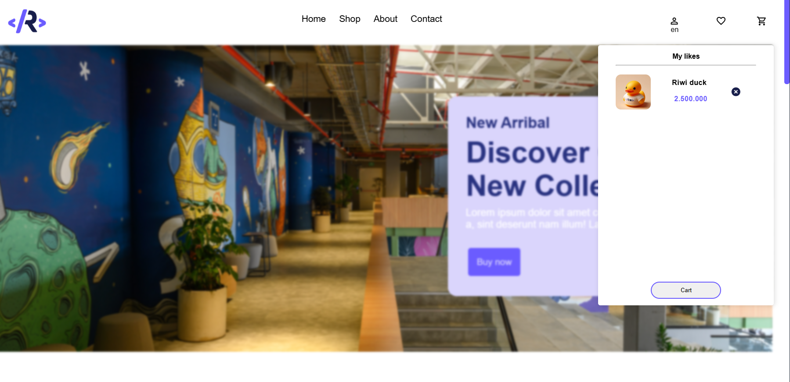

# Riwi-Shop

### repository:
```bash
   https://github.com/Harolin-23/Riwi-Shop
  ```

E-comerce para los productos de Riwi es una web donde el objetivo sea vender y ejecutar redencion de RiwiPoints para obtener productos de riwi.
en este repositorio se subiera el trabjo que se realizo algunos meses,se evicenciara el codigo vanilla,el diseño UX/UI la organizacion y distribucion y tambien las funciones de la web.

## Home desing


### Diseño de la Home
La landing page presenta un diseño moderno con una combinación de colores vibrantes, como el morado y azul, que captan la atención y le dan un toque creativo. La imagen de fondo con un mural colorido complementa perfectamente el estilo visual.

En cuanto a la UX/UI, la página es intuitiva y fácil de navegar. El menú superior es minimalista, facilitando el acceso a las secciones clave (`Home`, `Shop`, `About`, `Contact`). Los iconos de usuario están claramente posicionados a la derecha, haciendo que las funciones de login, wishlist, y carrito de compras sean accesibles sin esfuerzo.

El mensaje promocional en la sección principal es grande y claro, acompañado de un botón de llamada a la acción (CTA) destacado que guía al usuario hacia la compra de forma directa. La estructura del diseño asegura una experiencia de usuario fluida, con elementos bien organizados y visualmente atractivos que impulsan la interacción.

- ### Shop cart Modal
    
    Este modal Permite Seleccionar Productos de la pagina y agregar, sumar cantidad, ir al checkout con los productos y eliminarlos de este mismo,por el sistema este se ejecuta bajo el local storage
  y añade los productos uno a uno,y si detecta que es repetido este mismo se encarga de sumar la cantidad.

 - ### Liked Modal
      
       Este modal Permite Seleccionar Productos de la pagina y agregarlos a tus me gustas.

 - ### Liked Modal
      
       Este modal Permite redireccionar a la pagina de Login si tienes una cuenta y te da la opcion de redireccionar a la pagina de registro si no se cuanta con una
       tambien como hace parte de la interfaz de usurio este mismo añade un select que se encarga de organizar el idioma para la web.

## Product section
Este apartado cuenta con la muestra de los productos y la seleccion de acciones con estos mismos sea (`Like`, `More info`, `add Cart`, `reedem`).
las Acciones de esto mismo interactura con los modales anteriormente nombrados para una respuesta con el usuario y el producto.


